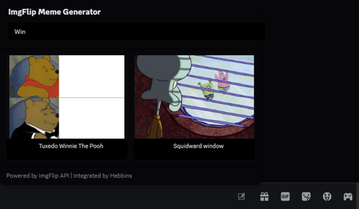
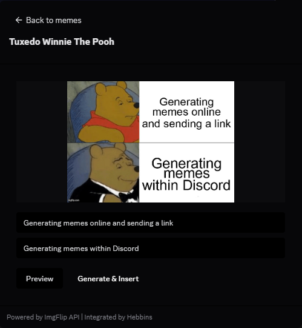
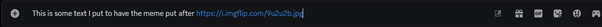
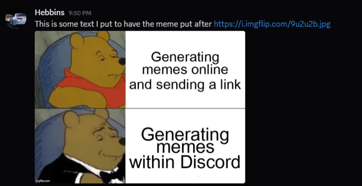

# ImgFlip BetterDiscord Plugin

Generate and send ImgFlip memes on the fly.

## Before you start
This is a plugin for the BetterDiscord Discord plugin and doesn't work
with Vanilla Discord.  
Once the plugin is enabled, you will need to create an ImgFlip account
for use of their API. You can choose to go with a Premium account for
access to more templates, or just stay with the free account for access
to free templates.  

Please keep in mind that your ImgFlip password is stored locally, so
please set it to something that isn't used elsewhere (your bank, social
media... Discord account)
 

## Generating a meme

Select the meme editor icon from the textbox  

Search for a meme template  

Enter your text for the meme. Preview allows you to see the changes
before sending  

Hit generate a send and a link to the meme will be placed into the text
area  

Hit send  
